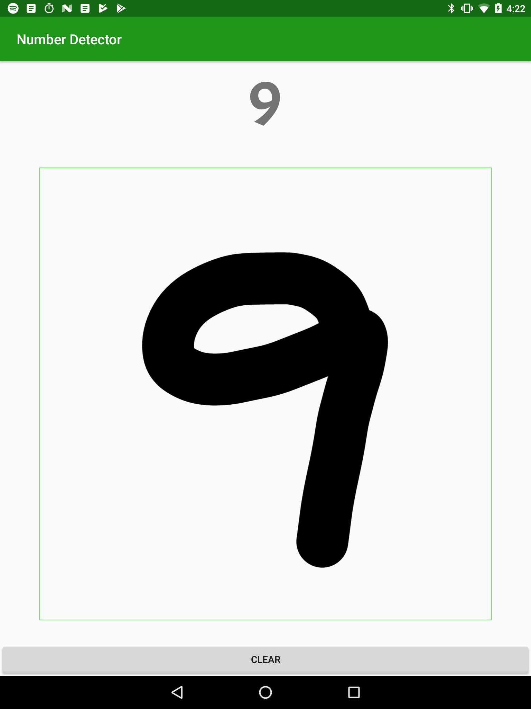

NumberDetector

Using ML in an Android demo app - The Good, The Bad, and the Ugly
=================================================================

## MassTLC Machine Learning Developer Day, January 24, 2019

The app demonstrates using the MNIST dataset to recognize hand-drawn digits on an Android.

We use ML Kit in Firebase (that stores the TensorFlow Lite model).

  

The google-services.json file obtained from my Firebase account is not checked in.
Here are steps to obtain your own google-services.json file, as well as to connect the demo app to Firebase.
1. Create a Firebase account: sign in at console.firebase.google.com
       > Add project e.g. NumberDetector
       > Download google-services.json
       > follow paged instructions to update the app project in Android Studio
2. Last step: connect the app to Firebase by running the app from IDE
       > Run | Run app
3. But Catch-22 is: what if app is not ready/debugged?
A hack to try: use Firebase Assistant in Android Studio to pick any (benign) Firebase feature to connect the app
   From Android Studio:
       > Tool | Firebase > e.g. Test Lab
       > Run (click on link) Firebase Test Lab from Android Studio > Connect app to Firebase
